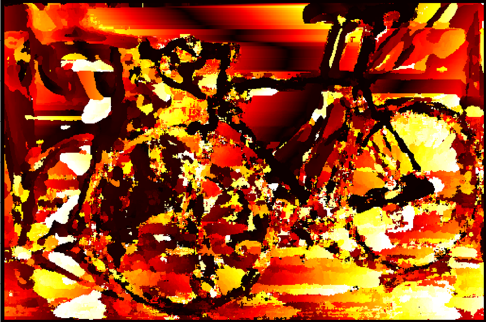
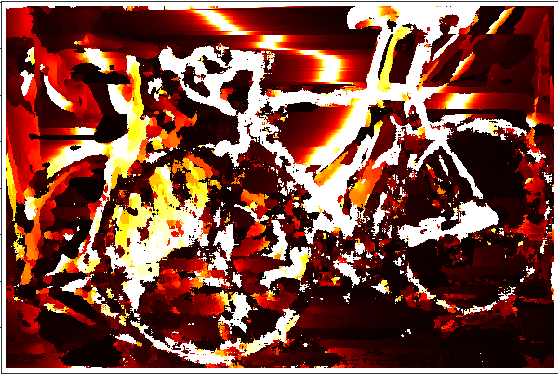
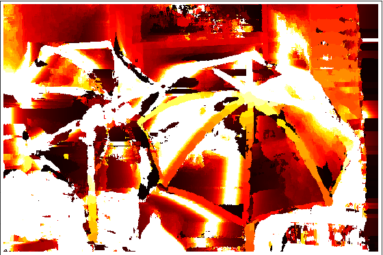

# Depth-Using-Stereo
In this project we calculate the depth using Stereo vision, given two images from a camera captured at different poses

## How to run the code:
Run as:
	python3 stereo.py -dataset 1 -path 'DataSets/Dataset 1'
	python3 stereo.py -dataset 2 -path 'DataSets/Dataset 2'
	python3 stereo.py -dataset 3 -path 'DataSets/Dataset 3'
	(the path argument should contain the complete end path to the two images)

## Output images:
### SIFT Matches

### Rectified Epipolar lines

### Disparity map

### Depth map

## Results:
https://drive.google.com/drive/folders/17bMJsVr_L3CIB7A0DQGo7w2xyyWFhgIO?usp=sharing
